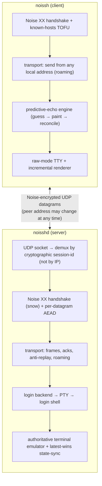
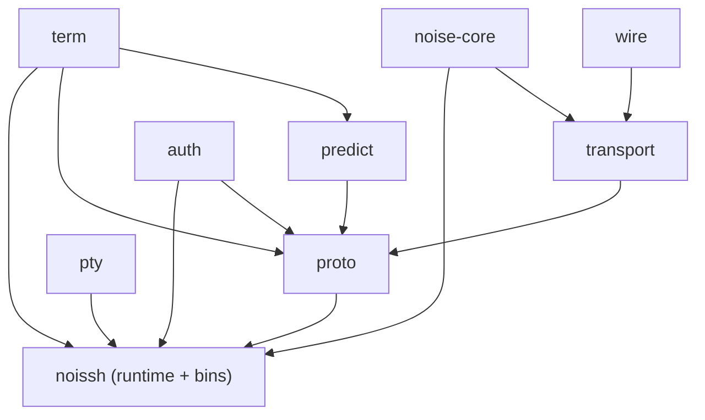

# noissh Architecture

This document describes how noissh is structured, how data flows through it, and
why the pieces are split the way they are. For the wire format and protocol
details see [PROTOCOL.md](PROTOCOL.md); for the trust/threat model see
[SECURITY.md](SECURITY.md).

## Goals

noissh aims to be **highly resilient** and **as rich as SSH**, with all
cryptography provided by the [Noise Protocol Framework](https://noiseprotocol.org/)
("Noise all the way down"). The novel engineering is the **hybrid resilient
transport + predictive TTY overlay**; account/login/privilege machinery reuses
the operating system (the SSH bootstrap logs the user in) rather than reinventing
it. The entire codebase is `#![forbid(unsafe_code)]` — there is no `unsafe` in any
crate; OS primitives are reached through safe-API crates.

## High-level picture



## Crate layout

The project is a Cargo workspace. Each crate has one clear responsibility and is
independently testable; lower crates know nothing about higher ones.

```
crates/
  wire/        frame codec (varint, datagram + stream frame classes)
  noise-core/  snow wrapper: XX handshake + stateless transport AEAD
  transport/   session-id, roaming, anti-replay, input channel, stream mux
  term/        authoritative terminal emulator + latest-wins screen diff
  predict/     client-side predictive-echo engine
  auth/        known_hosts (TOFU) + authorized_keys, X25519 key text format
  pty/         PTY allocation + login-shell launching (safe, via pty-process)
  proto/       handshake driver, control channel, state-sync data plane
src/           runtime (client/server cores + UDP drivers), config, tty, ssh
src/bin/       noissh (client) and noisshd (server) binaries
```

### Dependency direction



There are no cycles. `wire` and `noise-core` are the foundations; `proto` is the
integration layer; the root `noissh` crate adds I/O (sockets, PTYs, TTY) and the
binaries.

## The two cores

A central design choice is that all protocol logic lives in **I/O-free cores**:

- `proto::ServerShell` / `proto::ClientShell` — the state-sync data plane,
  operating purely on `wire::Frame`s.
- `noissh::server::ServerCore` / `noissh::client::ClientCore` — full
  session handling (handshake, auth, control, roaming) that consumes raw
  datagrams and returns raw datagrams to send. No sockets.

The `Server`/`Client` UDP drivers wrap the cores with a `UdpSocket` and an event
loop. Because the cores are socket-free, the **resilience harness** can drive
them through an in-memory shim that injects loss/reorder and rewrites source
addresses — exercising the exact production code path deterministically.

## Data flow: an interactive session

1. **Handshake.** The client picks a random session id and runs the Noise `XX`
   handshake inside `[type=0][session-id][noise msg]` packets. On completion both
   sides hold each other's authenticated static key.
2. **Trust.** The client checks the server key against `known_hosts` (TOFU); the
   server checks the client key against `authorized_keys` *before* creating any
   session or spawning a PTY.
3. **Shell open.** The client sends an `OpenShell` control message (retransmitted
   until the server begins sending screen state). The server allocates a PTY and
   execs the login shell.
4. **Output (server → client).** The PTY's output feeds the authoritative
   terminal emulator. The server sends latest-wins diffs of the screen
   (`StateDiff` frames). The client applies them to its render grid and acks.
5. **Input (client → server).** Keystrokes are an append-only byte stream sent
   reliably (`Input` frames retransmitted until acked) and written to the PTY.
6. **Prediction.** The client predicts the visible echo of keystrokes and paints
   it immediately (distinct styling), reconciling against authoritative diffs as
   they arrive.
7. **Roaming.** Any authenticated datagram from a new source address updates the
   server's notion of the peer address, so the session survives IP changes, NAT
   rebinding, and sleep/resume with no reconnect.

## Resilience model

- Every datagram carries the session id and is individually AEAD-authenticated.
- The server demuxes by session id, **not** by source IP:port.
- The interactive shell rides **unreliable latest-wins** datagrams: only the
  newest screen state matters, so packet loss never stalls a byte stream.
- A per-direction sliding-window replay filter drops replayed/very-old datagrams
  (Noise already guarantees strictly increasing nonces per direction).

## TTY / predictive echo

The server runs the only authoritative terminal emulator. The client is a "dumb"
render target plus a prediction overlay: it never re-emulates escape sequences,
it just applies cell/cursor diffs and paints predictions on top. Prediction is
**adaptive** — it only displays once the server has confirmed an echo, which
naturally suppresses predictions at non-echoing prompts (passwords).

## v2: reliable streams

The wire frame format reserves a **stream frame class** from day one. The
`transport::StreamMux` implements reliable, ordered, flow-controlled byte streams
(ARQ retransmit, in-order reassembly, sliding receive window) over the same
Noise/UDP session, which roams exactly like the v1 datagram path. This is the
substrate SSH-style richness (port forwarding, file transfer, agent forwarding)
builds on.

## Login & privilege model

The `pty` crate exposes a `LoginSession` trait with one backend, `LocalLogin`,
built on the safe `pty-process` crate (no `unsafe`):

- It allocates a real PTY and execs the login shell as the **current user** — no
  root required. This is the tested, default path.
- For multi-user use, the **SSH-bootstrap model** applies: the SSH bootstrap launches the
  server already running as the authenticated user, so no in-process `setuid` is
  needed.
- A standalone root daemon may optionally drop to a target user's `uid`/`gid`
  before exec (via `pty-process`'s safe API), with the supplementary-group
  caveat noted in [SECURITY.md](SECURITY.md).

Keeping the privileged surface minimal, isolating all parsing/crypto/protocol in
safe unprivileged code, and forbidding `unsafe` entirely are deliberate security
choices (see [SECURITY.md](SECURITY.md)).

## Testing strategy

- **Unit:** every crate (Noise transcript, frame round-trip + fuzz, emulator
  against escape-sequence corpora, `apply(diff(a,b)) == b` property tests, replay
  filter, input reassembly, stream mux under loss/reorder, predictive
  reconciliation).
- **Resilience harness:** in-process, real cores + real PTY, injecting
  loss/reorder and rewriting the source address mid-session.
- **Real-socket e2e:** actual `Server`/`Client` over loopback UDP, including a
  client socket rebind mid-session (roaming) and unauthorized-client rejection.
- **SSH bootstrap e2e:** a fake `ssh` launches the real one-shot server.
- **Security:** unauthorized key rejected before any session work; known_hosts
  mismatch; deterministic fuzzing of the packet handler and frame parser.
