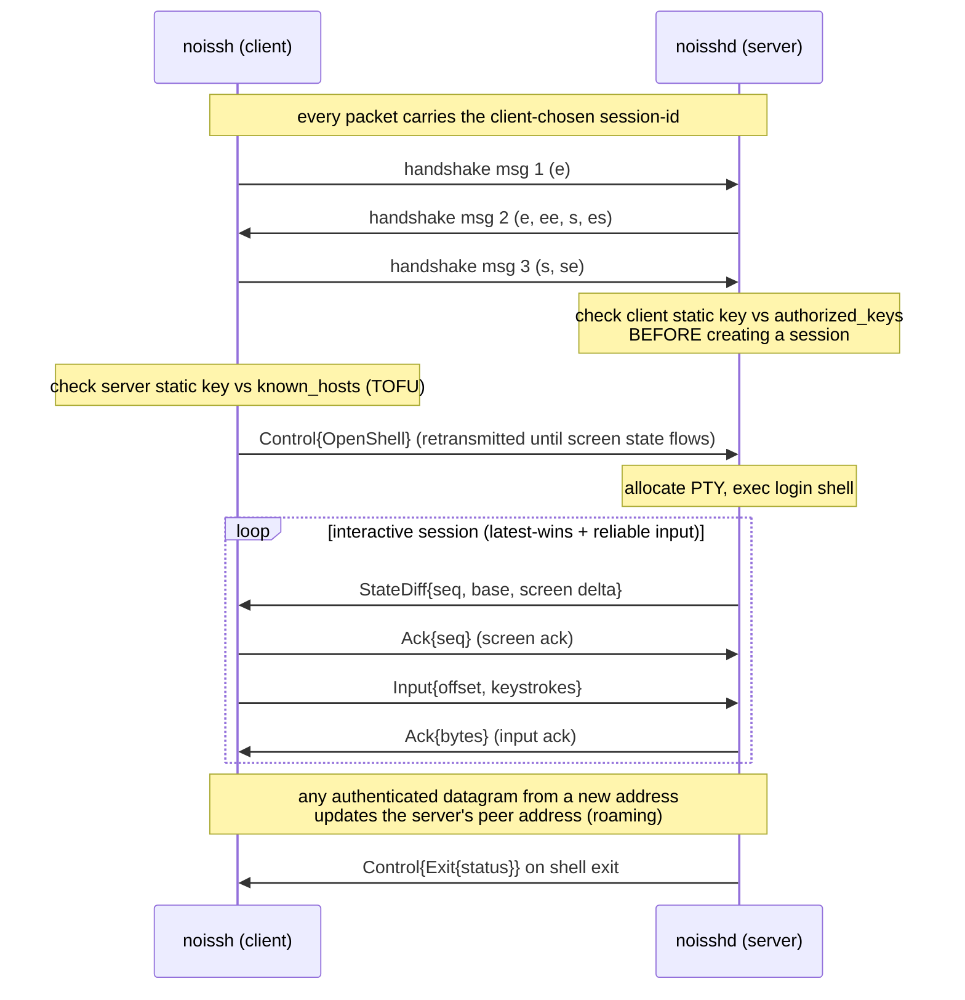

# noissh Protocol

This document specifies the noissh wire protocol as implemented: packet framing,
the handshake, the frame format, the interactive data plane, and the reliable
stream layer. It is descriptive of the current implementation, not a frozen
standard — the protocol is pre-1.0 and may change.

All multi-byte integers in headers are **big-endian**; all variable-length
integers inside frame payloads are **LEB128 unsigned varints**.

## 1. Cryptography

- Noise pattern: `Noise_XX_25519_ChaChaPoly_BLAKE2s`.
- Static keys are X25519 (32 bytes). Text form: `noissh-x25519 <base64(pubkey)>`.
- After the handshake, each side holds a `StatelessTransportState` providing AEAD
  with an explicit per-message 64-bit nonce, so reordered/lost datagrams are fine.

## 2. Packet framing (outer)

Every UDP datagram begins with a one-byte type and an 8-byte session id:

```
byte 0      : packet type (0 = handshake, 1 = transport)
bytes 1..9  : session id (8 bytes, chosen by the client, constant per session)
```

### Handshake packet (type 0)

```
[0x00][session-id(8)][noise handshake message ...]
```

### Transport packet (type 1)

```
[0x01][session-id(8)][nonce(8, BE)][AEAD ciphertext ...]
```

The ciphertext decrypts (under the session's transport keys and the given nonce)
to a **frame payload**: a concatenation of frames (section 4). The session id is
plaintext (needed for demux) but unauthenticated; tampering with it simply routes
to a different/absent session and decryption fails.

## 3. Handshake (XX)

Three messages, carried in handshake packets that all share the client-chosen
session id:

```
client → server :  e
server → client :  e, ee, s, es
client → server :  s, se
```

After message 3 both parties are in transport mode and each has the other's
authenticated static public key. The server then checks the client key against
`authorized_keys` **before** creating a session; the client checks the server key
against `known_hosts` (TOFU).

**Version signalling.** Message 2 carries the server's version string as its
(encrypted) Noise payload, so the client knows it the instant the handshake
completes — no extra round trip. This lets a direct connection notice an outdated
standing daemon and offer to upgrade it. The payload is confidential and bound to
the server's static key (same trust as the session). Servers/clients that predate
this still interoperate: the server also sends the version as a post-handshake
`ServerVersion` control message (§6), which older clients use as a fallback.

Session-id reuse: the server keys in-progress handshakes and established sessions
by session id, independent of source address.

**Anti-amplification.** The client pads its initial handshake datagram (message 1)
to a fixed floor (the padding rides as the first Noise message's ignored
payload), and the server refuses to reply to — or create state for — a new-session
init smaller than that floor. The handshake reply can therefore never be larger
than what was received, so a spoofed-source init cannot be used to reflect
amplified traffic. A read failure for an *already-pending* session id does not
discard its state (the id is plaintext, so otherwise an injected packet could
abort an in-flight handshake).



## 4. Frame format (inner, after decryption)

Each frame is `[type byte][fields...]`. Frames are packed back-to-back to fill a
datagram payload. Length-prefixed byte fields use a varint length followed by the
bytes. Signed integers use zig-zag varint encoding.

| Type | Name | Fields |
|---|---|---|
| `0x01` | `Ack` | `seq: varint` |
| `0x02` | `Input` | `offset: varint`, `data: bytes` |
| `0x03` | `StateDiff` | `seq: varint`, `base: varint`, `data: bytes` |
| `0x04` | `Resize` | `cols: varint`, `rows: varint` |
| `0x05` | `Ping` | `stamp: varint` |
| `0x06` | `Pong` | `stamp: varint` |
| `0x10` | `StreamOpen` | `id: varint`, `kind: u8`, `meta: bytes` |
| `0x11` | `StreamData` | `id: varint`, `offset: varint`, `fin: u8`, `data: bytes` |
| `0x12` | `StreamAck` | `id: varint`, `ack: varint`, `window: varint` |
| `0x13` | `StreamClose` | `id: varint`, `status: zigzag varint` |
| `0x14` | `StreamReset` | `id: varint` |
| `0x20` | `Control` | `data: bytes` (a control message, section 6) |

`StreamKind`: `0 = Session`, `1 = Forward` (`-L`/`-R`/`-D`), `2 = FileTransfer`
(`--put`/`--get`), `3 = Agent` (`-A`), `4 = Exec` (trailing `noissh user@host <cmd>`).

Unknown frame types and truncated fields are hard decode errors (the whole
datagram is dropped). The decoder is fuzzed and never panics on arbitrary input.

## 5. Interactive data plane (v1)

The interactive shell uses two reliable-ish overlays plus latest-wins state-sync.
Note the **direction-specific meaning of `Ack`**:

- client → server `Ack{seq}` acknowledges the highest applied screen-state seq.
- server → client `Ack{seq}` acknowledges contiguous input bytes received.

### Input (client → server)

Keystrokes are an append-only byte stream. The client sends `Input{offset, data}`
for everything not yet acknowledged, retransmitting until the server's input ack
advances. The server reconstructs the exact contiguous stream regardless of loss,
reorder, or duplication, and replies with `Ack{bytes_received}`.

### Screen state (server → client)

The server keeps the authoritative terminal grid. It assigns each distinct screen
a monotonically increasing `seq`, and emits `StateDiff{seq, base, data}` where
`data` is a diff from the client's last **acknowledged** state (`base`). A diff is
either a full snapshot (applicable regardless of base; e.g. after a resize) or a
delta listing only changed cells. The client applies full snapshots
unconditionally and deltas only when `base` matches its current state and `seq`
is newer, then sends `Ack{seq}`. This converges under arbitrary loss/reorder
(latest-wins): only the newest screen matters.

### Screen diff encoding

```
[tag u8: 0=full, 1=delta]
[rows varint][cols varint][cursor_row varint][cursor_col varint][cursor_visible u8]
full : rows*cols cells
delta: [count varint] then count × ([index varint][cell])
cell : [char as varint][fg color][bg color][flags u8]
color: [0]                | [1][index u8] | [2][r u8][g u8][b u8]
```

## 6. Control messages (inside `Control` frames)

```
0x01 OpenShell     : cols varint, rows varint, term string, agent u8
0x02 Resize        : cols varint, rows varint
0x03 Exit          : status zigzag varint
0x06 RemoteForward : bind_port varint, target string   (client→server, -R)
0x07 Bye           : (no payload)                       (client→server)
0x08 ServerVersion : version string                     (server→client)
```

`ServerVersion` is a fallback for the handshake-payload version signalling (§3):
a v0.5.3+ client learns the version directly from message 2, but the server still
sends this control message once after the session is established so a pre-v0.5.3
client can also notice an outdated daemon.
`OpenShell`'s `agent` byte requests SSH agent forwarding (`-A`). Strings are
`varint length` + UTF-8 bytes. (Tags `0x04`/`0x05` are reserved — they were a
never-wired second-factor prompt/response, since removed.)

## 7. Reliable streams (v2)

`StreamMux` provides reliable, ordered, flow-controlled byte streams over the same
session. Locally-initiated stream ids use parity to avoid collisions (client even,
server odd); a peer-opened stream of the wrong parity is rejected, and the number
of concurrent peer-opened streams is capped. Per stream:

- **Send:** buffered bytes from the acked offset, sent within the smaller of the
  peer's advertised window and a **congestion window** (slow start / congestion
  avoidance, collapsing to one segment on loss). Unacked data is retransmitted
  after a **retransmit timeout derived from a smoothed RTT estimate**
  (Jacobson/Karels, with Karn's algorithm and exponential backoff), not on every
  poll. `fin` marks the last byte.
- **Receive:** out-of-order segments are reassembled into a contiguous stream; the
  receiver advertises a window of `DEFAULT_WINDOW - unread` so an idle reader
  applies backpressure (flow control). Frames that overflow or fall outside the
  window are dropped, and a peer FIN offset is recorded only once.
- **Lifecycle:** `StreamOpen` (with kind + metadata) announces a stream;
  `StreamClose{status}` is a graceful close carrying an exit status (the exec
  channel uses it to deliver the command's exit code); `StreamReset` is an abort.

The stream metadata identifies the endpoint per kind: `Forward` carries the
target `host:port` (dial-out target for `-L`/`-D`, or the client-side delivery
target announced via the `RemoteForward` control message for `-R`); `FileTransfer`
carries a `PUT <size> <path>` / `GET <path>` request; `Exec` carries the command;
`Agent` has none. Streams roam with the session exactly like the v1 datagram path.

## 8. Anti-replay & roaming

- Each direction has an independent nonce space; Noise guarantees strictly
  increasing nonces.
- The receiver keeps a 64-packet sliding-window filter and drops replayed or
  too-old nonces.
- A datagram is authenticated **before** it is allowed to update the peer address,
  so a forged datagram from a new address cannot hijack a session.

## 9. SSH bootstrap (optional)

An SSH bootstrap: `ssh <host> noisshd --one-shot --authorize <client pub>`.
The one-shot server binds an ephemeral UDP port, prints

```
NOISSH CONNECT <port> <base64 server pubkey>
```

on stdout, then detaches (daemonizes) and serves one session. The client parses
that line, pins the server key (delivered over the authenticated SSH channel), and
connects over the normal Noise/UDP protocol above.
